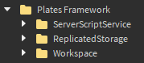

# Plates Framework
This is the documentation on how to use the Plates Framework

The Plates Framework allows you to create games like [Horrifc Housing](https://www.roblox.com/games/263761432/UPDATE-Horrific-Housing), [Plates Of Fate](https://www.roblox.com/games/4783966408/Plates-of-Fate-Remastered), and [Cursed Islands](https://www.roblox.com/games/990566015/Cursed-Islands) \
It is easy to use, the only thing you need to do is create the actions that happen to the plate and players. There are also settings that allow you to configure the entire games functionality.

# Links
Get Plates Framework: \
My Roblox Page: https://www.roblox.com/users/121516972/profile \
Discord: pleb!#2792 \
Discord Server: https://discord.gg/na7sEM4WBN

# Setup
**1.** Move everything within the folders according to its folder name (Take them out of the folder) \


**2.** Now create your spawns, you can make these invisible, just insert a part(s) for each spawn and put them in the according folders(LobbySpawns/Plates) \
*The framework will choose a random spawn*

Everything should be done, there is 1 premade action for each action type. You can delete them. (All they do is explode a player or a plate)

**Custom Plate**
To make a custom plate you will need to follow these steps. \
**1.** Put your plate into a model. \
**2.** Name the model "PlateTemplate". \
**3.** Name the floor of the plate "Base". \
**4.** Set the "PrimaryPart" of the model to the "Base". \
**5.** Put the model into the "RoundSystem" (ServerScriptService/Modules/RoundSystem)

**AFK**
There is a AFK bool value located in Players/"Player"/Data/AFK, just set it to true to make the player AFK.

# Settings
The settings module is located in ReplicatedStorage/Modules/Settings \
You can open it up and change the settings to your liking.

# Actions
The action module is located in ServerScriptService/Modules/RoundSystem/ActionSystem/(Player and Plate) \
**Player:** An action that happens to a player \
**Plate:** An action that happens to a plate 

If you want to add an action just follow these steps. \
**1.** Create a module script and put it in the according folder. (Player / Plate) \
**2.** Put in the following code and change the 1st argument to whatever you want.
```lua
function Action(Arg)
	if Arg then
		
	end
end

return Action
```
*The argument returns either the player or the plate* \
**3.** Write the code to the action you want to create. 

The RoundSystem will select a random player or plate action to happen.

# UI
The Plates Framework doesnt have any built in ui functions, but here is how you can add some.

**Timer** \
***1.*** Set up your timer ui. \
***2.*** Put a local script within the ui. \
***3.*** Insert code into the local script.
```lua
local ReplicatedStorage = game:GetService("ReplicatedStorage")
local RoundInProgress = Players:WaitForChild("RoundInProgress")

local function SetTimer()
	local Time = RoundInProgress:GetAttribute("Timer")
	local Timer = script.Parent:WaitForChild("Timer")
	Timer.Text = tostring(Time)
end
SetTimer()

RoundInProgress:GetAttributeChangedSignal("Timer"):Connect(SetTimer)
```
*This is only a very simple example on how you can set up a timer ui.*

**Status** \
***1.*** Set up your status ui. \
***2.*** Put a local script within the ui. \
***3.*** Insert code into the local script.
```lua
local ReplicatedStorage = game:GetService("ReplicatedStorage")
local RoundInProgress = Players:WaitForChild("RoundInProgress")

local function SetStatus()
	local Status = RoundInProgress:GetAttribute("Status")
	local StatusLabel = script.Parent:WaitForChild("Status")
	if Status == "NEP" then
		Status = "Not enough players."
	end
	StatusLabel.Text = Status
end
SetStatus()

RoundInProgress:GetAttributeChangedSignal("Status"):Connect(SetStatus)
```
*This is only a very simple example on how you can set up a status ui.*

**Notification** \
***1.*** Set up your notification ui. \
***2.*** Put a local script within the ui. \
***3.*** Insert code into the local script.
```lua
local ReplicatedStorage = game:GetService("ReplicatedStorage")
local RoundInProgress = Players:WaitForChild("RoundInProgress")
local Dead = Players:WaitForChild("Dead")

RoundInProgress:GetAttributeChangedSignal("Winner"):Connect(function()
	local WinnerAttribute = RoundInProgress:GetAttribute("Winner")
	local WinnerLabel = script.Parent:WaitForChild("Win")
	if WinnerAttribute ~= nil and WinnerAttribute ~= "" then
		WinnerLabel.Text = WinnerAttribute.." Has Won!"
		task.wait(5)
		WinnerLabel.Text = ""
	end
end)

Dead.ChildAdded:Connect(function(Value)
	print(Value)
	local Text = Value.Name.." Has Died!"
	local DiedLabel = script.Parent:WaitForChild("Died")
	DiedLabel.Text = Text
	task.wait(1)
	if DiedLabel.Text == Text then
		DiedLabel.Text = ""
	end
end)
```
*This is only a very simple example on how you can set up a notification ui.*
